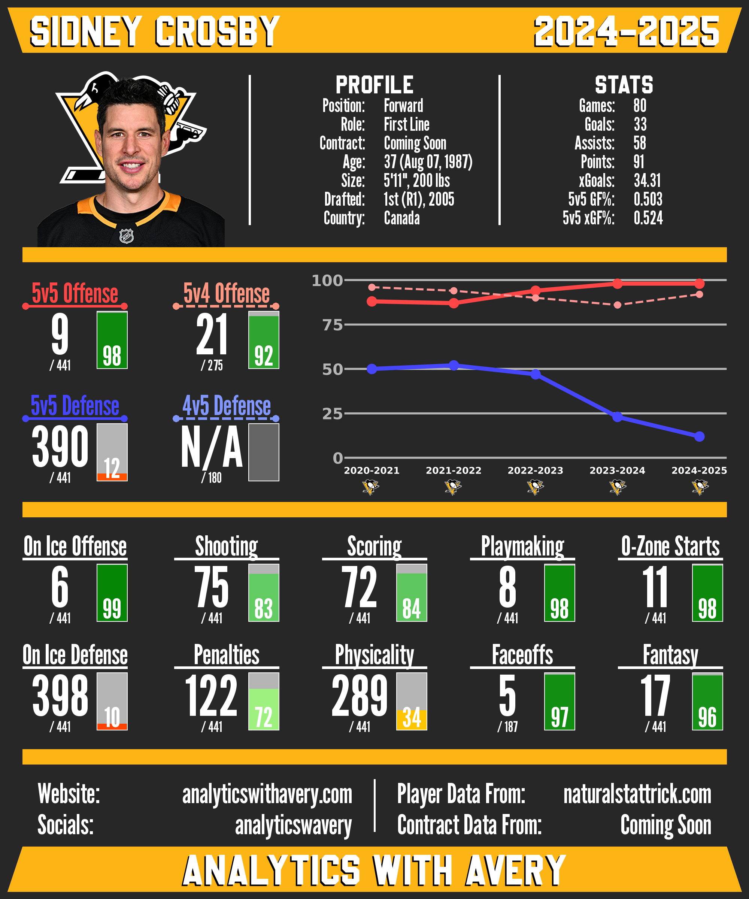

# NHL Player Stat Cards

## Description
An end-to-end data pipeline to scrape NHL player information and statistics, calculate attribute scores and rankings, and generate visually appealing cards for individual players.

### Features
* **Natural Stat Trick Scraping:** Collects player bios and situational statistics, including all situation, 5-on-5, 5-on-4, and 4-on-5, for forwards, defensemen, and goalies.
* **NHL API Integration:** Retrieves player IDs and goalie game logs directly from the NHL API.
* **Yearly Attribute Scoring & Rankings:** Generates season-specific player attribute scores and rankings using weighted performance metrics.
* **Multi-Season Weighted Rankings:** Produces weighted attribute scores by combining current and prior season scores.
* **Card Data Assembly:** Aggregates player information, statistics, and weighted rankings into structured datasets optimized for visualization.
* **Player Card Generation:** Generates PNG stat cards featuring player headshots, info, stats, team branding, attribute rankings, percentile bars, and multi-season attribute trend graphs.

<p align="center">
  
  <br />
  <em>Example player card.</em>
</p>


## Installation
### Prerequisites
* **Python 3.9+**
* **GTK+ Runtime** (Required for CairoSVG to render vector graphics to PNG)

### Setup
1. **Clone the repository:**

```bash
git clone https://github.com/AveryJD/project-nhl-player-cards.git
cd project-nhl-player-cards
```

2. **Create a virtual environment:**

```bash
python -m venv venv
source venv/bin/activate  # On Windows: venv\\Scripts\\activate
```

3. **Install dependencies:**

```bash
pip install -r requirements.txt
```


## Usage
The typical workflow is:
1. Scrape and clean raw data
2. Generate rankings and assemble card data
3. Generate visual player stat cards


### Step 1: Collect & Clean Data
This step scrapes and stores all raw data required for rankings and card generation.

Open utils/constants.py and set the seasons you want to process (in the format 'YYYY-YYYY', ex: '2024-2025'):
```python
# Seasons to scrape stats and bio data for
DATA_SEASONS = ['2024-2025', '2023-2024', '2022-2023', '2021-2022', '2020-2021', '2019-2020',
                '2018-2019', '2017-2018', '2016-2017', '2015-2016', '2014-2015', '2013-2014',
                '2012-2013', '2011-2012', '2010-2011', '2009-2010', '2008-2009', '2007-2008']
```

Execute the following script:
```bash
python src/collect_data.py
```

This script will:
* Scrape team logos from NHL.com (only needs to be collected once, so after the first run, this step can be commented out in src/collect_data.py)
* Scrape player bios and situational statistics from Natural Stat Trick
* Retrieve player IDs and goalie game logs from the NHL API
* Save all raw data locally for downstream processing

Note: Depending on the number of seasons, collecting data could take several minutes due to the implemented request delays to respect Natural Stat Trick’s servers.

All scraped data CSV files will be saved to the 'data_scraped' folder, and team logo SVGs will be saved to the 'data_card' folder.


### Step 2: Generate Rankings and Card Data
This step transforms raw data into player rankings and structured card-ready datasets.

Open utils/constants.py and set the seasons you want to process (Natural Stat Trick's earliest season is 2007-2008):
```python
# Seasons to make single seasons rankings for
YEARLY_RANK_SEASONS = ['2024-2025', '2023-2024', '2022-2023', '2021-2022', '2020-2021', '2019-2020',
                       '2018-2019', '2017-2018', '2016-2017', '2015-2016', '2014-2015', '2013-2014',
                       '2012-2013', '2011-2012', '2010-2011', '2009-2010', '2008-2009', '2007-2008']

# Seasons to make weighted rankings for
WEIGHTED_RANK_SEASONS = ['2024-2025', '2023-2024', '2022-2023', '2021-2022', '2020-2021', '2019-2020',
                         '2018-2019', '2017-2018', '2016-2017', '2015-2016', '2014-2015', '2013-2014',
                         '2012-2013', '2011-2012', '2010-2011', '2009-2010']

# Seasons to gather total card info for
CARD_INFO_SEASONS = ['2024-2025', '2023-2024', '2022-2023', '2021-2022', '2020-2021', '2019-2020',
                     '2018-2019', '2017-2018', '2016-2017', '2015-2016', '2014-2015', '2013-2014',
                     '2012-2013', '2011-2012', '2010-2011', '2009-2010']
```

Execute the following script:
```bash
python src/prepare_data.py
```

This script will:
* Generate season-specific attribute scores and rankings
* Create weighted attribute scores and rankings using current and prior seasons
* Assemble all player data required for card generation

Generated ranking CSV files will be saved to the 'data_ranking' folder, and card data CSV files will be saved to the 'data_card' folder.


### Step 3: Generate Cards
Once rankings and card data are prepared, this step generates visual player stat cards.

Call functions in src/generate_cards.py to choose what cards to generate:
```python
# Different functions for generating player cards:
card_generation.make_player_card('Sidney Crosby', '2024-2024', 'F', 'dark')
card_generation.make_team_player_cards('TOR', '2024-2025', 'light')
card_generation.make_all_position_player_cards('2024-2025', 'G', 'dark')
card_generation.make_all_player_cards('2024-2025', 'light')
```

Available card generation options include:
* Single player cards
* Full team card sets
* Position-specific league-wide cards
* Full league card generation

Execute the following script:
```bash
python src/generate_cards.py
```

Generated card PNGs will be saved the 'cards' folder.

## License
This project is licensed under the GNU General Public License v3.0. See the LICENSE file for details.


## Acknowledgments
* Data sourced from [Natural Stat Trick](https://www.naturalstattrick.com) and the NHL API.
* Project inspiration: [JFresh](https://x.com/JFreshHockey) & [Rono](https://x.com/RonoAnalyst).


## Disclaimer
This project is for educational and analytical purposes and is not affiliated with the NHL.
