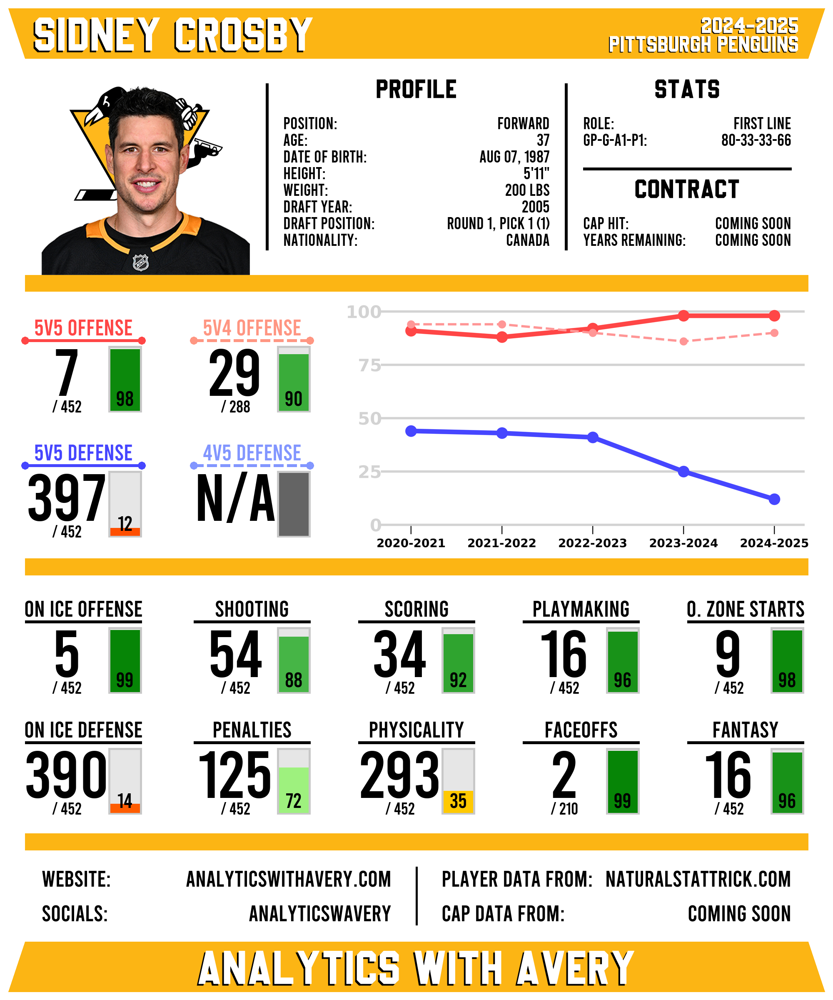

# NHL Player Stat Cards

## Project Components

### NHL Player Data Scraping
- Scraped player data from [NaturalStatTrick.com](https://www.naturalstattrick.com/) using **BeautifulSoup4**
- Collected skater and goalie profile data and stats, including individual and on-ice metrics  
- Cleaned raw data for consistency and usability
- Saved the processed data into organized CSV files using Pandas  

### Player Attributes Ranking Model
- Built a ranking model that scores each player across various performance attributes based on scraped statistics using **NumPy**
- Adjusts attribute scores based on games played and time on ice
- Compares players' scores to assign a ranking for each attribute  
- Outputs a CSV file containing all player attribute scores and rankings
- Creates weighted normalized rankings based on multiple seasons of rankings using **Scikit-learn**

### Player Rankings Card Generation
- Collect all relevent data for player cards including player information, stats, and rankings
- Generated visually appealing PNG player cards displaying player info and attribute rankings using **PIL**
- Incorporated player headshots from the NHL API and profile data for informative card headings  
- Displayed ranking sections including attribute rank, total players, and percentile bars  
- Visualized ranking trends over time with graphs generated using **Matplotlib**  

## Sample Card

## Upcoming Additions
- Player salary information  
- Improve player and goalie ranking models for better accuracy
- Fully fledged goalie cards

## Technologies Used
- Python
- Pandas
- BeautifulSoup4
- NumPy
- Scikit-learn
- Matplotlib
- PIL

## Resources
- NHL player data: [NaturalStatTrick.com](https://www.naturalstattrick.com)  
- NHL player headshots and team logos: NHL API  
- Project inspiration: [JFresh](https://x.com/JFreshHockey/with_replies) & [Rono](https://x.com/ronoanalyst?lang=en)  
