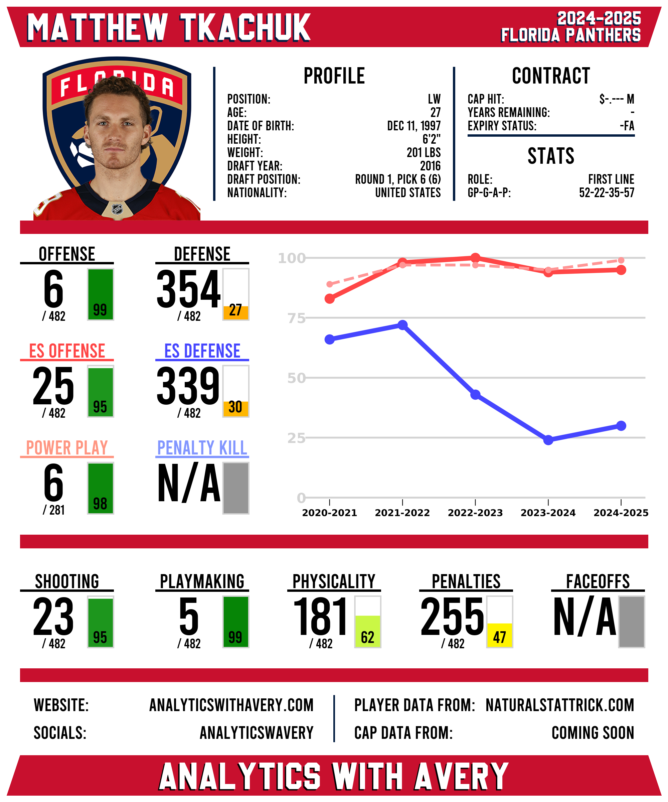

# NHL Player Attribute Rankings and Card Generation

## Project Components

### NHL Player Data Scraping
- Scraped player data from [NaturalStatTrick.com](https://www.naturalstattrick.com/) using BeautifulSoup4  
- Collected skater and goalie profile data and stats, including individual and on-ice metrics  
- Cleaned raw data for consistency and usability
- Saved the processed data into organized CSV files using Pandas  

### Player Attributes Ranking Model
- Built a ranking model that scores each player across various performance attributes based on scraped statistics  
- Adjusts attribute scores based on games played and time on ice
- Compares players' scores to assign a ranking for each attribute  
- Outputs a CSV file containing all player attribute scores and rankings  

### Player Rankings Card Generation
- Used PIL to generate visually appealing PNG player cards displaying player info and attribute rankings  
- Incorporated player headshots from the NHL API and profile data for informative card headings  
- Displayed ranking sections including attribute rank, total players, and percentile bars  
- Visualized ranking trends over time with graphs generated using Matplotlib  

## Sample Card

## Upcoming Additions
- Player salary information  
- Improved player and (especially) goalie models  

## Languages and Libraries/Frameworks Used
- Python
- Pandas
- BeautifulSoup4
- Requests
- NumPy
- Matplotlib
- PIL

## Resources
- NHL player data from [NaturalStatTrick.com](https://www.naturalstattrick.com)  
- NHL player headshots from the NHL API  
- Project inspired by cards from [JFresh](https://x.com/JFreshHockey/with_replies) and [Rono](https://x.com/ronoanalyst?lang=en)  
