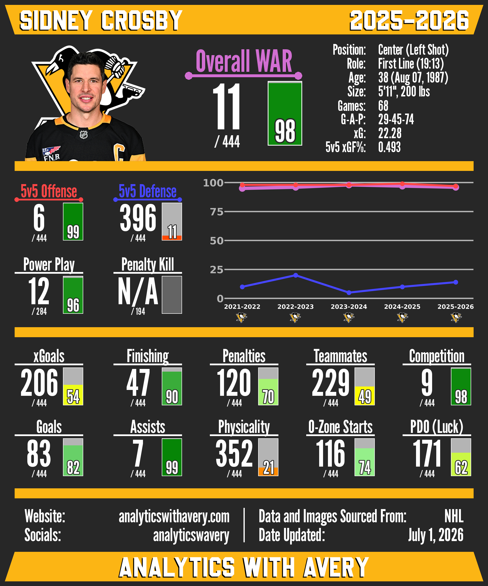

# NHL Player Stat Cards

## Description
An end-to-end data pipeline to scrape NHL player information and statistics, calculate attribute scores and rankings, and generate visually appealing cards for individual players.

### Features
* **NHL API Scraping:** Retrieves player IDs, bios, game schedules, team standings, play-by-play data, shift charts, and goalie game logs directly from the NHL API.
* **Expected Goals (xG) Model:** Trains its own shot-level xG model (per strength state) from scraped shot event data, used as the response variable for RAPM and to power finishing/goaltending value metrics.
* **RAPM & WAR:** Computes Regularized Adjusted Plus-Minus (RAPM) from shift-by-shift on-ice lineup data, and converts it (along with finishing and penalty impact) into Wins Above Replacement (WAR).
* **Quality of Teammates / Quality of Competition:** Computes true TOI-weighted Quality of Teammates (QoT) and Quality of Competition (QoC) scores from shift-by-shift on-ice overlap.
* **Yearly Attribute Scoring & Rankings:** Generates season-specific player attribute scores and rankings using weighted performance metrics.
* **Multi-Season Weighted Rankings:** Produces weighted attribute scores by combining current and prior season scores, using weights empirically fit to the combination that best predicts each player's next-season performance.
* **Card Data Assembly:** Aggregates player information, statistics, and rankings into structured datasets optimized for visualization.
* **Player Card Generation:** Generates PNG stat cards, including full player cards (headshot, team branding, player info, stats, attribute rankings, percentile bars, and multi-season trend graphs).

<p align="center">
  
  <br />
  <em>Example player card.</em>
</p>


## Installation
### Prerequisites
* **Python 3.9+**
* **GTK+ Runtime** (Required for CairoSVG to render vector graphics to PNG)

### Setup
1. **Clone the repository:**

```bash
git clone https://github.com/AveryJD/project-nhl-player-cards.git
cd project-nhl-player-cards
```

2. **Create a virtual environment:**

```bash
python -m venv venv
source venv/bin/activate  # On Windows: venv\\Scripts\\activate
```

3. **Install the package (and its dependencies):**

```bash
pip install -e .
```

A requirements.txt is also included if it is prefered to install from that directly

```bash
pip install -r requirements.txt
```


## Usage
The typical workflow is:
1. Scrape raw data
2. Process raw data into scores and rankings, and assemble card data
3. Generate visual player stat cards


### Step 1: Collect Data
This step scrapes and stores all raw data required for rankings and card generation.

Open src/player_card_project/constants.py and set the seasons you want to process (ideally have at least three consecutive seasons in the format 'YYYY-YYYY', ex: '2024-2025'):
```python
# Seasons to scrape stats and bio data for
DATA_SEASONS = ['2009-2010', '2010-2011', '2011-2012', '2012-2013', '2013-2014',
                '2014-2015', '2015-2016', '2016-2017', '2017-2018', '2018-2019',
                '2019-2020', '2020-2021', '2021-2022', '2022-2023', '2023-2024',
                '2024-2025', '2025-2026']
```

Execute the following script:
```bash
python -m player_card_project.collect_data
```

This script will:
* Scrape card fonts from the web (only needs to be collected once, so after the first run, this step can be commented out in src/player_card_project/collect_data/__main__.py)
* Scrape team logos from NHL.com (also only needs to be collected once)
* Retrieve player IDs, bios, game schedules, and team standings from the NHL API
* Scrape play-by-play data (goals, shot events, faceoffs, penalty events, and possession events) from the NHL API
* Scrape shift charts from the NHL API, used to compute quality of teammates/competition and the project's own xG/RAPM/WAR models
* Scrape boxscore GP/TOI data and goalie game logs from the NHL API
* Save all raw data locally for downstream processing

All scraped data CSV files will be saved to various folders in 'data/player_card_data/raw_data', and team logo SVGs will be saved to the 'data/assets/team_logos' folder.

Note: Depending on the number of seasons, collecting data could take hours due to the implemented request delays to respect the NHL API's servers.


### Step 2: Generate Rankings and Card Data
This step transforms raw data into player rankings and structured card-ready datasets, using the same DATA_SEASONS set in Step 1.

Execute the following script:
```bash
python -m player_card_project.process_data
```

This script will:
* Train (or reuse) this project's own expected goals (xG) model from scraped shot event data
* Process raw shift data into teammate/competition TOI overlap matrices
* Assemble per-season, per-position player stats
* Generate RAPM (Regularized Adjusted Plus-Minus) and WAR (Wins Above Replacement) scores
* Generate season-specific attribute scores and rankings
* Create weighted attribute scores and rankings using current and prior seasons
* Assemble all player data required for card generation

Generated data will be saved to various folders in 'data/player_card_data/processed_data', and card data CSV files will be saved to the 'data/player_card_data/card_data' folder.

Note: Depending on the number of seasons, processing data could take hours due to how computationally heavy the player scoring is.


### Step 3: Generate Cards
Once rankings and card data are prepared, this step generates visual player stat cards.

Call functions in src/player_card_project/generate_cards/__main__.py to choose what cards to generate:
```python
card_generation.make_player_card('Sidney Crosby', '2025-2026', 'F', 'dark')

"""
Parameters:
  Player Full Name ('First Last')
  Season ('YYYY-YYYY')
  Position Code ('F', 'D', or 'G')
  Card Mode ('Light' or 'Dark')
"""
```

Execute the following script:
```bash
python -m player_card_project.generate_cards
```

Generated card PNGs will be saved to the 'player_cards' folder.


## License
This project is licensed under the GNU General Public License v3.0. See the LICENSE file for details.


## Acknowledgments
* Data sourced from the NHL API.
* Project inspiration: [HockeyStats.com](https://hockeystats.com/cards/player-cards).


## Disclaimer
This project is for educational and analytical purposes and is not affiliated with the NHL.
